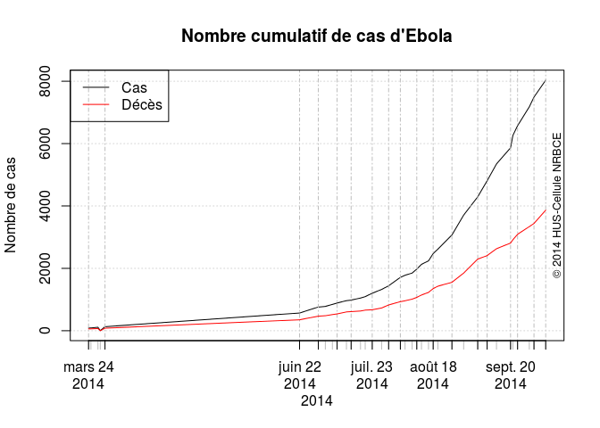
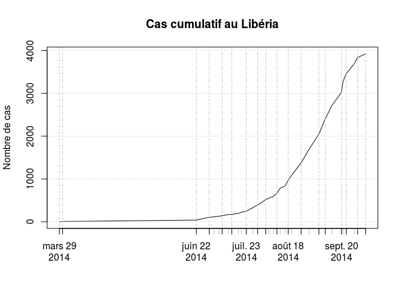

# EVB par pays
JcB  
10/07/2014  

Suivi de l'épidémie de fièvre EBOLA en 2014
===========================================

source: [promed mail](http://www.promedmail.org) et [OMS](http://who.int/csr/don/2014_07_15_ebola/en/)

[OMS en français](http://who.int/csr/don/archive/disease/ebola/fr/)

[OMS en anglais](http://who.int/csr/don/archive/disease/ebola/en/)

[CDC](http://www.cdc.gov/vhf/ebola/)

[healthmap](http://www.healthmap.org/fr/)

Le 7/8/2014 les donnée sont saisies dans un document partagé sur drive (Ebola). Le fichier _EBOLA 2014 - Pays.csv_ remplace le fichier _EVB_pays.csv_. Idem pour newcases.csv. Dans le document RPU_xml on trouvera une méthode pour importer le tableau de l'OMS via R.

Les données sont colligées dans __EVB_PromedMail.ods__ puis réenregistrées au format .csv dans __EVB_pays.csv__.


```
Loading required package: zoo

Attaching package: 'zoo'

The following objects are masked from 'package:base':

    as.Date, as.Date.numeric
```

```
 [1] "EVB_Promed"    "Date"          "Pays"          "Localisation" 
 [5] "Total"         "Confirmed"     "Probable"      "Suspected"    
 [9] "Death"         "DCD_Confirmed" "DCD_Probable"  "DCD_suspected"
```

```
'data.frame':	89 obs. of  12 variables:
 $ EVB_Promed   : int  NA NA NA NA NA NA 72 72 72 77 ...
 $ Date         : Date, format: "2014-03-24" "2014-03-25" ...
 $ Pays         : Factor w/ 6 levels "Congo","Guinea",..: 2 2 2 3 2 3 2 6 3 2 ...
 $ Localisation : logi  NA NA NA NA NA NA ...
 $ Total        : int  86 90 112 2 122 8 390 136 41 413 ...
 $ Confirmed    : int  NA NA NA NA 24 2 258 103 24 293 ...
 $ Probable     : int  NA NA NA NA 78 NA 88 19 9 88 ...
 $ Suspected    : int  NA NA NA NA 22 NA 44 14 8 32 ...
 $ Death        : int  59 60 70 2 80 2 267 58 25 303 ...
 $ DCD_Confirmed: int  NA NA NA NA 13 1 NA NA NA 193 ...
 $ DCD_Probable : int  NA NA NA NA 67 1 NA NA NA 82 ...
 $ DCD_suspected: int  NA NA NA NA 0 0 NA NA NA 28 ...
```
Sommes par pays
---------------

- __dcd__ nombre total de décès
- __cas__ nombre total de cas
- __cfr__ mortalité globale (en %)
- __cas.g__ total des cas en Guinée
- __dcd.g__ total des décès en Guinée
- __cfr.g__ mortalité en Guinée
- __cas.sl__ nombre total de cas en Sierra Leone
- __dcd.sl__ total des décès en Sierra L
- __ cfr.sl__mortalité  en SL
- __cas.lb__ nombre total de cas au Libéria
- __dcd.lb__ total des décès au Libéria
- __cfr.lb__mortalité au Libéria
- __dcd.ng__ total des décès au Nigéria
- __cas.ng__ total des cas au Nigéria
- __cfr.ng__ mortalité au Nigéria

NB: les cas représentent la somme des cas suspects, probables et confirmés.


```
## [1] 3707
```

```
## [1] 1848
```

```
## 
## 
## |      | Total| Guinée| Sierra Leone| Libéria| Nigéria| Senegal|
## |:-----|-----:|------:|------------:|-------:|-------:|-------:|
## |cas   |  3707|    771|         1216|    1698|      21|       1|
## |Décès |  1848|    494|          476|     871|       7|       0|
```

```
##       Guinea      Liberia      Nigéria      Senegal Sierra Leone 
##          771         1698           21            1         1216
```

    

```
## Warning: le type de graphe 'bars' sera tronqué au premier caractère
```

 

```
## 2014-03-24 2014-03-25 2014-03-28 2014-03-29 2014-03-31 2014-06-22 
##         86         90        112          2        130        567 
## 2014-06-30 2014-07-03 2014-07-06 2014-07-08 2014-07-12 2014-07-14 
##        759        779        844        888        964        982 
## 2014-07-18 2014-07-20 2014-07-23 2014-07-27 2014-07-30 2014-08-04 
##       1048       1093       1201       1323       1440       1711 
## 2014-08-06 2014-08-09 2014-08-11 2014-08-13 2014-08-16 2014-08-18 
##       1779       1848       1975       2127       2240       2473 
## 2014-08-20 2014-08-26 2014-08-31 
##       2615       3070       3707
```

```
## 2014-03-24 2014-03-25 2014-03-28 2014-03-29 2014-03-31 2014-06-22 
##         59         60         70          2         82        350 
## 2014-06-30 2014-07-03 2014-07-06 2014-07-08 2014-07-12 2014-07-14 
##        467        481        518        539        603        613 
## 2014-07-18 2014-07-20 2014-07-23 2014-07-27 2014-07-30 2014-08-04 
##        632        660        672        729        826        932 
## 2014-08-06 2014-08-09 2014-08-11 2014-08-13 2014-08-16 2014-08-18 
##        961       1013       1069       1145       1229       1350 
## 2014-08-20 2014-08-26 2014-08-31 
##       1427       1552       1848
```
Dernier bilan: 2014-08-31  
Nombre cumulé de cas: $3707$  
Nombre cumulé de décès: $1848$  
Mortalité globale: $49.85$ %   
- mortalité en Guinée: $64.07$ %  
- mortalité au Libéria: $51.3$ %  
- mortalité en Sierra Leone: $39.14$ %  

New Cases et Courbe épidémique
==============================

Depuis le 26/8, l'OMS n'indique plus le nombre de nouveaux cas. Il faut donc les calculer par soustraction des 2 derniers bilans.

Exemple avec la Guinée:

```r
a <- tapply(d$Total[d$Pays=="Guinea"], d$Date[d$Pays=="Guinea"], sum)
n <- length(a)
b <- a[n] - a[n-1]
```
Pour la Guinée:  
- dernier bilan: 2014-08-31  
- nombre total de nouveau cas: 123


```
##        CONGO       GUINEE      LIBERIA      NIGERIA      SENEGAL 
##            3           40           26           11            1 
## SIERRA-LEONE 
##           28
```

  

Nouveaux cas par pays
---------------------
      

ToDo: cartographie
