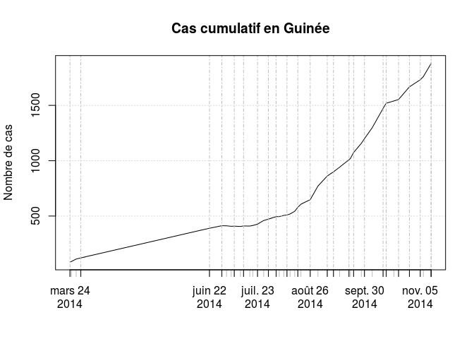
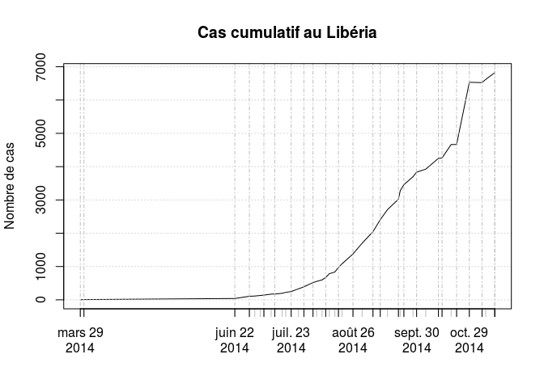
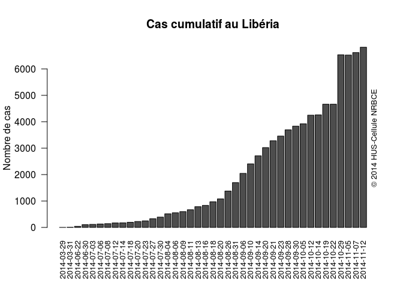
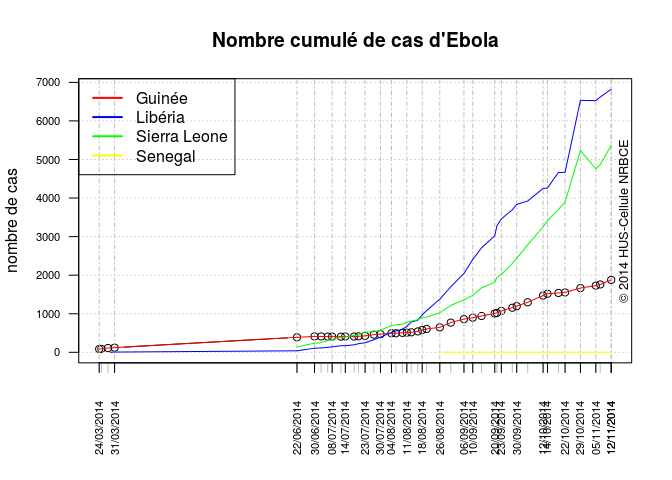
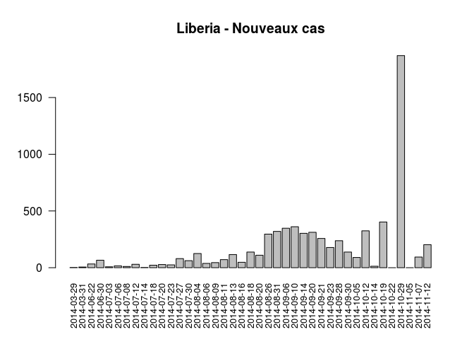

# EVB par pays
JcB  
10/07/2014  

Suivi de l'épidémie de fièvre EBOLA en 2014
===========================================

source: [promed mail](http://www.promedmail.org) et [OMS](http://who.int/csr/don/2014_07_15_ebola/en/)

[OMS en français](http://who.int/csr/don/archive/disease/ebola/fr/)

[OMS en anglais](http://who.int/csr/don/archive/disease/ebola/en/)

[CDC](http://www.cdc.gov/vhf/ebola/)

[healthmap](http://www.healthmap.org/fr/)

[R Bloggers](http://www.r-bloggers.com/1-2-millions-deaths-by-ebola-projected-within-six-months/) et le [tableau](https://docs.google.com/spreadsheets/d/1GaQg5MgnwxlT_J447N3em8L8obNfwOMfAUEXD6oc4ck/edit#gid=0) associé.


Le 7/8/2014 les donnée sont saisies dans un document partagé sur drive (Ebola). Le fichier _EBOLA 2014 - Pays.csv_ remplace le fichier _EVB_pays.csv_. Idem pour newcases.csv. Dans le document RPU_xml on trouvera une méthode pour importer le tableau de l'OMS via R.

Les données sont colligées dans __EVB_PromedMail.ods__ puis réenregistrées au format .csv dans __EVB_pays.csv__.


```
Loading required package: zoo

Attaching package: 'zoo'

The following objects are masked from 'package:base':

    as.Date, as.Date.numeric
```

```
 [1] "EVB_Promed"    "Date"          "Pays"          "Localisation" 
 [5] "Total"         "Confirmed"     "Probable"      "Suspected"    
 [9] "Death"         "DCD_Confirmed" "DCD_Probable"  "DCD_suspected"
[13] "HCW_case"      "HCW_dcd"      
```

```
'data.frame':	163 obs. of  14 variables:
 $ EVB_Promed   : int  NA NA NA NA NA NA 72 72 72 77 ...
 $ Date         : Date, format: "2014-03-24" "2014-03-25" ...
 $ Pays         : Factor w/ 8 levels "Congo","Guinea",..: 2 2 2 3 2 3 2 6 3 2 ...
 $ Localisation : logi  NA NA NA NA NA NA ...
 $ Total        : int  86 90 112 2 122 8 390 136 41 413 ...
 $ Confirmed    : int  NA NA NA NA 24 2 258 103 24 293 ...
 $ Probable     : int  NA NA NA NA 78 NA 88 19 9 88 ...
 $ Suspected    : int  NA NA NA NA 22 NA 44 14 8 32 ...
 $ Death        : int  59 60 70 2 80 2 267 58 25 303 ...
 $ DCD_Confirmed: int  NA NA NA NA 13 1 NA NA NA 193 ...
 $ DCD_Probable : int  NA NA NA NA 67 1 NA NA NA 82 ...
 $ DCD_suspected: int  NA NA NA NA 0 0 NA NA NA 28 ...
 $ HCW_case     : int  NA NA NA NA NA NA NA NA NA NA ...
 $ HCW_dcd      : int  NA NA NA NA NA NA NA NA NA NA ...
```

Légendes
--------

- HCW_case: personnel de santé contaminés
- HCW_dcd : personnel de santé DCD d'ebola

Sommes par pays
---------------

- __dcd__ nombre total de décès
- __cas__ nombre total de cas
- __cfr__ mortalité globale (en %)
- __cas.g__ total des cas en Guinée
- __dcd.g__ total des décès en Guinée
- __cfr.g__ mortalité en Guinée
- __cas.sl__ nombre total de cas en Sierra Leone
- __dcd.sl__ total des décès en Sierra L
- __ cfr.sl__mortalité  en SL
- __cas.lb__ nombre total de cas au Libéria
- __dcd.lb__ total des décès au Libéria
- __cfr.lb__mortalité au Libéria
- __dcd.ng__ total des décès au Nigéria
- __cas.ng__ total des cas au Nigéria
- __cfr.ng__ mortalité au Nigéria

NB: les cas représentent la somme des cas suspects, probables et confirmés.


```
## [1] 9936
```

```
## [1] 4877
```

         Total   Guinée   Sierra Leone   Libéria   Nigéria   Senegal   USA   Esgagne
------  ------  -------  -------------  --------  --------  --------  ----  --------
cas       9936     1540           3706      4665        20         1     3         1
Décès     4877      904           1259      2705         8         0     1         0

```
##       Guinea      Liberia      Nigéria      Senegal Sierra Leone 
##         1540         4665           21            3         3706 
##        Spain          USA 
##            1            3
```

      

```
## Warning in plot.xy(xy, type, ...): le type de graphe 'bars' sera tronqué
## au premier caractère
```

 

```
## 2014-03-24 2014-03-25 2014-03-28 2014-03-29 2014-03-31 2014-06-22 
##         86         90        112          2        130        567 
## 2014-06-30 2014-07-03 2014-07-06 2014-07-08 2014-07-12 2014-07-14 
##        759        779        844        888        964        982 
## 2014-07-18 2014-07-20 2014-07-23 2014-07-27 2014-07-30 2014-08-04 
##       1048       1093       1201       1323       1440       1711 
## 2014-08-06 2014-08-09 2014-08-11 2014-08-13 2014-08-16 2014-08-18 
##       1779       1848       1975       2127       2240       2473 
## 2014-08-20 2014-08-26 2014-08-31 2014-09-06 2014-09-10 2014-09-14 
##       2615       3070       3707       4293       4806       5347 
## 2014-09-20 2014-09-21 2014-09-23 2014-09-28 2014-09-30 2014-10-05 
##       5864       6263       6574       7179       7492       8034 
## 2014-10-12 2014-10-14 2014-10-19 
##       8997       9216       9936
```

```
## 2014-03-24 2014-03-25 2014-03-28 2014-03-29 2014-03-31 2014-06-22 
##         59         60         70          2         82        350 
## 2014-06-30 2014-07-03 2014-07-06 2014-07-08 2014-07-12 2014-07-14 
##        467        481        518        539        603        613 
## 2014-07-18 2014-07-20 2014-07-23 2014-07-27 2014-07-30 2014-08-04 
##        632        660        672        729        826        932 
## 2014-08-06 2014-08-09 2014-08-11 2014-08-13 2014-08-16 2014-08-18 
##        961       1013       1069       1145       1229       1350 
## 2014-08-20 2014-08-26 2014-08-31 2014-09-06 2014-09-10 2014-09-14 
##       1427       1552       1848       2296       2408       2630 
## 2014-09-20 2014-09-21 2014-09-23 2014-09-28 2014-09-30 2014-10-05 
##       2811       2917       3091       3338       3439       3865 
## 2014-10-12 2014-10-14 2014-10-19 
##       4493       4555       4877
```
Dernier bilan: 2014-10-19  
Nombre cumulé de cas: 9936  
Nombre cumulé de décès: 4877  
Mortalité globale: 49.08 %   
- mortalité en Guinée: 58.7 %  
- mortalité au Libéria: 57.98 %  
- mortalité en Sierra Leone: 33.97 %  

New Cases et Courbe épidémique
==============================

Depuis le 26/8, l'OMS n'indique plus le nombre de nouveaux cas. Il faut donc les calculer par soustraction des 2 derniers bilans.

Exemple avec la Guinée:

```r
source("ebola_functions.R")

a <- tapply(d$Total[d$Pays=="Guinea"], d$Date[d$Pays=="Guinea"], sum)
n <- length(a)
b <- a[n] - a[n-1]
```
Pour la Guinée:  
- dernier bilan: 2014-10-19  
- nombre total de nouveau cas: 21

Il faut répéter l'opération pour les autres comptes (Confirmed, Probable, suspected) et les autres pays => function

Il est possible de simplifier le calcul en utilisant l'instruction __diff__ qui calcule les différences successives.


```r
state <- "Liberia"
a <- tapply(d$Total[d$Pays == state], d$Date[d$Pays == state], sum)
a1 <- names(a)
a2 <- as.numeric(a)
a3 <- c(0, diff(a)) # premier élément = 0 car 1ère différence nulle
a3[a3 < 0] <- 0 # si différence négative on ramène à 0
b <- data.frame(a1,a2,a3)
names(b) <- c("date","cumul","delta")

# On crée autant d'enregistrements qu'il y a de cas
x.date <- rep(b$date, b$delta)
ebola <- epicurve.weeks(x.date, sunday = FALSE, axisnames = FALSE, col="#A8DDB5")
axis(1, at = ebola$xvals, labels = ebola$cweek, tick = FALSE, line = 0)
axis(1, at = ebola$xvals, labels = ebola$cmonth, tick = FALSE, line = 1)
title(main= paste0(state,": Ebola - Nouveaux cas"), ylab = "fréquence", xlab = "2014 - semaines")
```

 

```r
# voir la routine new.case()
xl <- new.case(d, state)
plot(as.Date(xl$date), xl$cumul, type="l")
```

 

```r
plot(as.Date(xl$date), xl$delta, type="h")
```

 

```r
barplot(xl$delta, names.arg=xl$date, las=2, cex.names = 0.8, main = paste0(state," - Nouveaux cas"))
```

 

```r
# idem avec new.death()
xd <- new.death(d, state)
barplot(xd$delta, names.arg=xd$date, las=2, cex.names = 0.8, main = paste0(state," - Nouveaux Décès"))
```

 

```r
# taux de mortalité brut et à 15 jours
mb <- xd$cumul/xl$cumul
plot(mb, type="l")
```

 

```r
xll <- c(1,1,xl$cumul) # impose un décalage de 15 jours
xdd <- c(xd$cumul,1,1)
r <- round(xdd/xll, 2)
plot(r, type="l")
```

 

Nouveaux cas: automatisation avec ebola_function
-------------------------------------------------

```r
state <- "Liberia"
nd <-new.case(d, state, "Death") # nouveau décès au Libéria
ebola.curve(nd, state, title="Décès")
```

 

```r
nc <-new.case(d, state, "Total")
ebola.curve(nc, state, title="Nouveaux cas")
```

 


```
##        CONGO       GUINEE      LIBERIA      NIGERIA      SENEGAL 
##            4           43           29           14            4 
## SIERRA-LEONE 
##           31
```

  

Nouveaux cas par pays
---------------------
      

ToDo: cartographie
